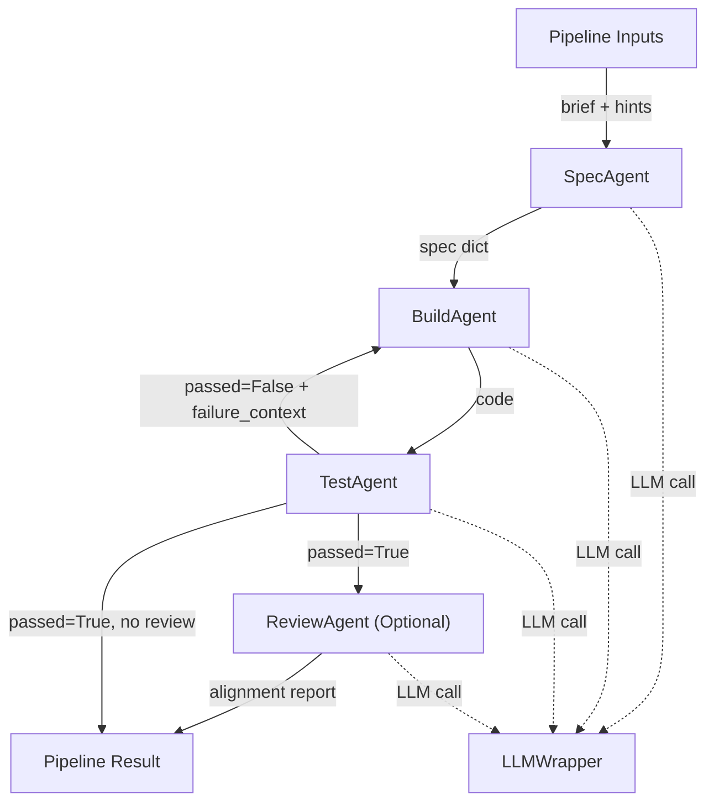
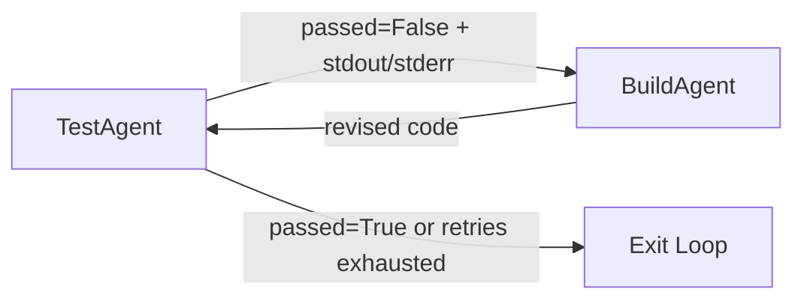
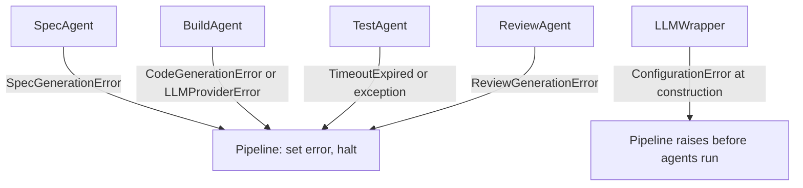
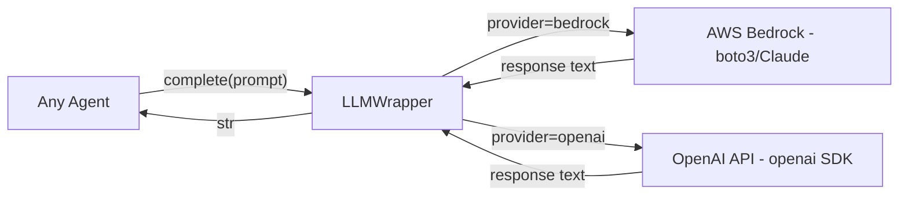

# AutoSpec Pipeline — Agent Handoff Diagram

This diagram documents the data flow and handoff contracts between agents in the AutoSpec Pipeline.

To view on mermaid.live: copy the content of any code block below (starting from `flowchart`) and paste it into the editor at https://mermaid.live

---

## Full Pipeline Flow



---

## Retry Loop



---

## Error Handling Paths



---

## LLMWrapper Provider Routing



---

## Agent Handoff Contracts

| From | To | Payload | Condition |
|------|----|---------|-----------|
| Pipeline Inputs | SpecAgent | `brief`, `acceptance_criteria_hints` | Always |
| SpecAgent | BuildAgent | `spec` dict: title, introduction, glossary, acceptance_criteria | On success |
| BuildAgent | TestAgent | `code` (str) | On success |
| TestAgent | BuildAgent | `failure_context` = stdout + stderr | When `passed=False` and retries remain |
| TestAgent | ReviewAgent | `code` + `spec` | When `passed=True` and review enabled |
| TestAgent | Pipeline Output | `test_result` dict | When `passed=True` or retries exhausted |
| ReviewAgent | Pipeline Output | `review` list of criterion/covered/notes | When ReviewAgent runs |

---

## Module Structure

```
autospec_pipeline/
├── pipeline.py          — Orchestrator: sequences agents, manages retry loop
├── errors.py            — AutoSpecError and all named subclasses
├── diagram.py           — build_handoff_diagram() Mermaid string builder
├── agents/
│   ├── spec_agent.py    — Brief → structured spec dict
│   ├── build_agent.py   — Spec dict → source code string
│   ├── test_agent.py    — Code → pytest execution → pass/fail + coverage
│   └── review_agent.py  — Spec + code → alignment report (optional)
└── llm/
    └── llm_wrapper.py   — Routes to Bedrock or OpenAI based on config
main.py                  — CLI entry-point
```
